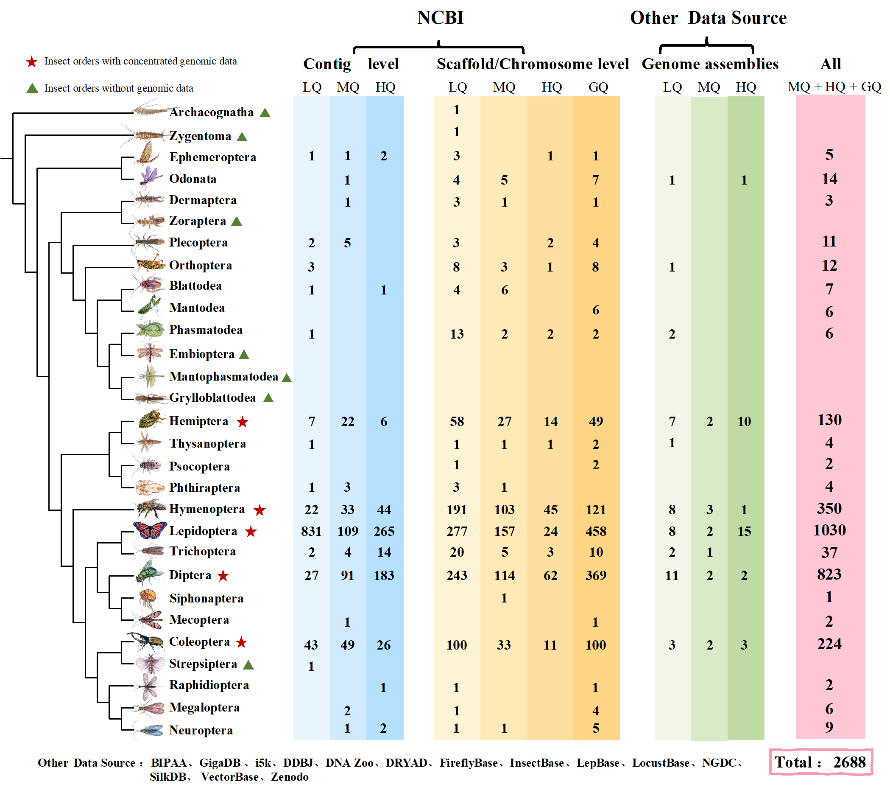

# InsectGTrends
 Data-Driven Exploration of Insect Whole-Genome Sequencing: Current Progress, Challenges, and Prospects

## 👩‍🏫👨‍🏫 Author 

Jing Sun1,2,3, Yingxue Xiao1, *et al.*

1) Integrative & Computational Biology Group, College of Life Sciences, Chongqing Normal University, Chongqing 401331, China; 
2) Chongqing Key Laboratory of Vector Insects, College of Life Sciences, Chongqing Normal University, Chongqing 401331, P. R. China; 
3) Animal Biology Key Laboratory of Chongqing Education Commission, College of Life Sciences, Chongqing Normal University, Chongqing 401331, P. R. China.

 

